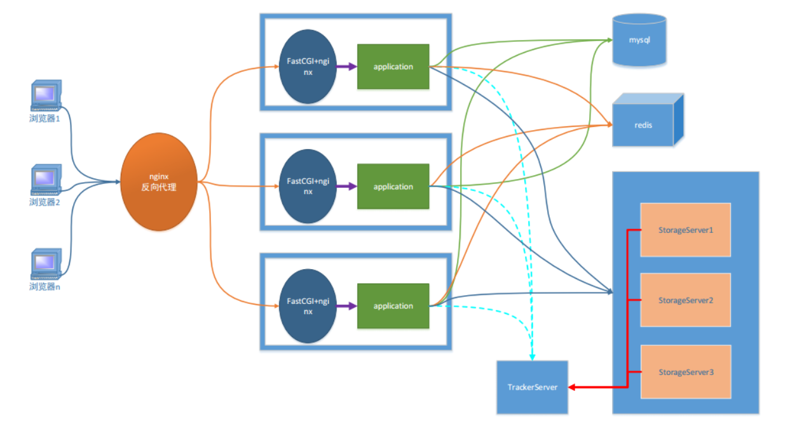
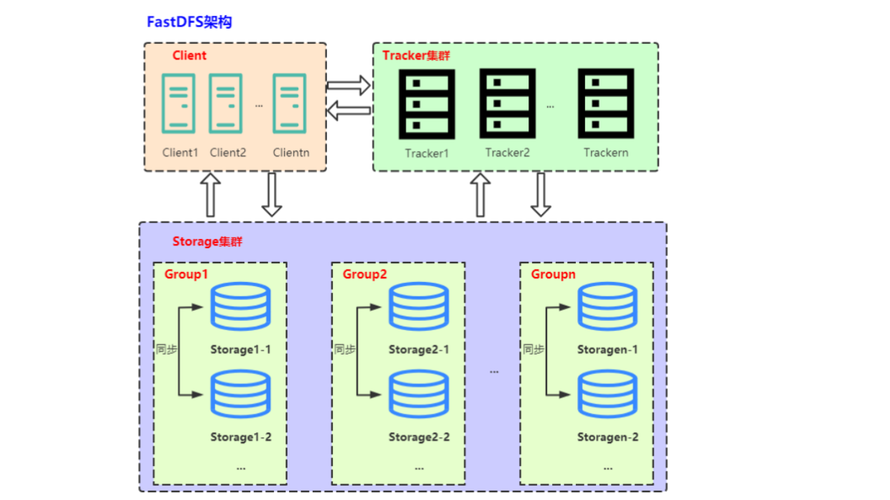

# Distributed-file-servers

---

Distributed file servers分布式文件服务器

- 文件资源：https://pan.baidu.com/s/1gnCkeL54td2iqAsHJBj6gQ?pwd=lt0r
- 课程资源：https://www.bilibili.com/video/BV1YG41137Vk/

### 项目架构

该项目是一个文件服务器，其主要功能是提供文件的上传、文件保存，当有需求时可以将文件下载的功能。

1. 客户端

    - b/s：必须使用http协议
    - c/s：协议可以随意选择，Qt -> http

2. 服务器

    - 静态请求：Nginx能处理静态请求 -> html, jpg

    - 动态请求：fastCGI帮助服务器处理动态请求
    - 服务器集群之后, 每台服务器上部署的内容必须相同

3. 反向代理服务器

    - 客户端并不能直接访问web服务器, 直接访问到的是反向代理服务器
    - 客户端静请求发送给反向代理服务器, 反向代理将客户端请求转发给web服务器

4. mysql关系型数据库

    - 存储文件属性信息
    - 用户的属性信息

5. redis - 非关系型数据库 (内存数据库)

    - 作用提出程序效率
    - 存储是服务器经常要从关系型数据中读取的数据

6. FASTDFS - 分布式文件系统

    - 存储文件内容
    - 供用户下载

### FASTDFS分布式文件系统

fastDFS是c语言编写的一款开源的分布式文件系统（余庆淘宝架构师）。为互联网量身定制，充分考虑了冗余备份、负载均衡、线性扩容等机制，注重高可用、高性能等指标。可以很容易搭建一套高性能的文件服务器集群提供文件上传、下载等服务。图床、网盘

1. 冗余备份: 纵向扩容
2. 线性扩容: 横向扩容

1. 追踪器Tracker（守护进程）：最先启动追踪器
2. 存储节点Storage（守护进程）：第二个启动的角色，存储节点启动之后, 会单独开一个线程
    - 汇报当前存储节点的容量, 和剩余容量
    - 汇报数据的同步情况
    - 汇报数据被下载的次数
3. 客户端：最后启动
    - 上传文件：连接追踪器, 询问存储节点的信息
        - 我要上传1G的文件, 询问那个存储节点有足够的容量
        
        - 追踪器查询, 得到结果
        
        - 追踪器将查到的存储节点的 IP + port 发送给客户端
        
        - 通过得到IP和端口连接存储节点
        
        - 将文件内容发送给存储节点（Socket通信）
        
            
    - 下载文件：连接追踪器, 询问存储节点的信息
        - 询问, 要下载的文件在哪一个存储节点
        
        - 追踪器查询, 得到结果
        
        - 追踪器将查到的存储节点的 IP + port 发送给客户端
        
        - 通过得到IP和端口连接存储节点
        
        - 下载文件（Socket通信）
        
            

### Redis

### Nginx

### FastCGI

### Nginx+fastDFS

