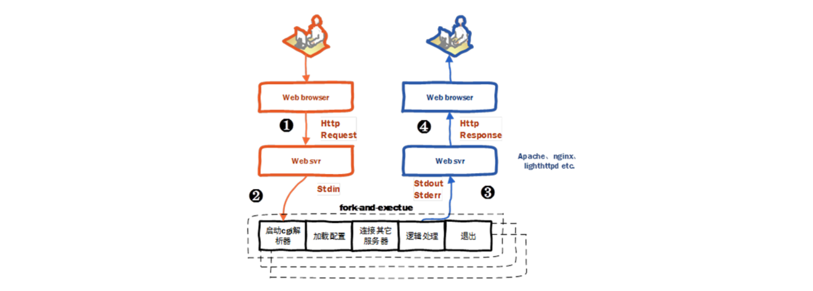
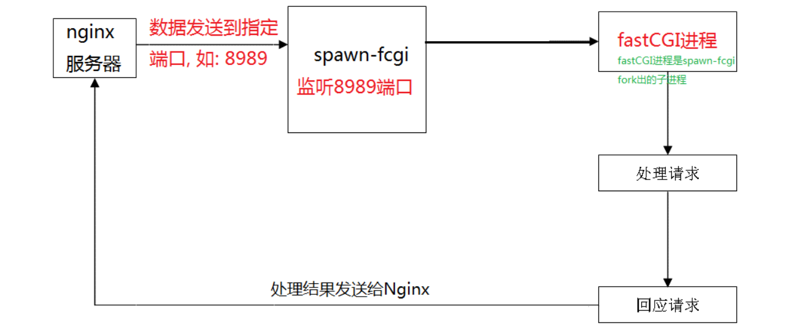
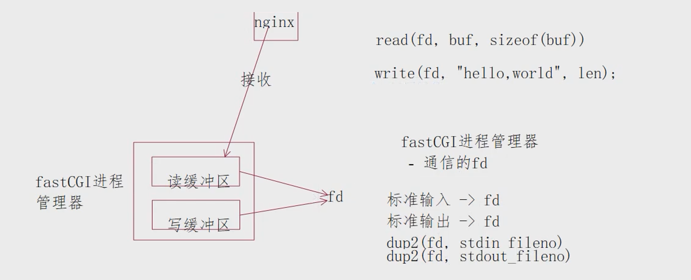

# fastCGI

---

### 一、CGI

通用网关接口（Common Gateway Interface/CGI）描述了客户端和服务器程序之间传输数据的一种标准，可以让一个客户端从网页浏览器向执行在网络服务器上的程序请求数据。CGI 独立于任何语言的，CGI 程序可以用任何<font color='#BAOC2F'>脚本语言</font>或者是完全独立<font color='#BAOC2F'>编程语言</font>实现，只要这个语言可以在这个系统上运行。




1. 用户通过浏览器访问服务器, 发送了一个请求, 请求的url如上
2. 服务器接收数据, 对接收的数据进行解析
3. nginx对于一些登录数据不知道如何处理, nginx将数据发送给了cgi程序
4. 服务器端会创建一个cgi进程，CGI进程执行
    - 加载配置, 如果有需求加载配置文件获取数据
    - 连接其他服务器: 比如数据库
    - 逻辑处理得到结果， 将结果发送给服务器
    - 线程结束生命退出
5. 服务器将cgi处理结果发送给客户端
6. 弊端：在服务器端CGI进程会被频繁的创建销毁，服务器开销大, 效率低

### 二、fastCGI

快速通用网关接口FastCommonGatewayInterface是通用网关接口CGI的改进，描述了客户端和服务器程序之间传输数据的一种标准。

FastCGI致力于<font color='#BAOC2F'>减少Web服务器与CGI程序之间互动的开销</font>，从而使服务器可以同时处理更多的Web请求。

与为每个请求创建新的进程不同，FastCGI使用持续的进程来处理一连串的请求（线程不会被销毁）。

这些进程由FastCGI进程管理器管理，而不是web服务器。 

- **fastCGI与CGI的区别:**CGI 就是所谓的短生存期应用程序，FastCGI 就是所谓的长生存期应用程序。FastCGI像是一个常驻(long-live)型的CGI，它可以一直执行着，不会每次都要花费时间去fork一次


1. 用户通过浏览器访问服务器, 发送了一个请求, 请求的url如上
2. 服务器接收数据, 对接收的数据进行解析
3. nginx对于一些登录数据不知道如何处理, nginx将数据发送给了fastcgi程序
    - 通过本地套接字
    - 网络通信的方式
4. fastCGI程序如何启动：不是有web服务器直接启动，通过一个fastCGI进程管理器启动
    - 加载配置（可选）
    - 连接服务器 - 数据库，循环
        - 服务器有请求 -> 处理，将处理结果发送给服务器：本地套接字、网络通信
        - 没有请求 -> 阻塞
5. 服务器将fastCGI的处理结果发送给客户端

4. fastcgi启动

### 三、fastCGI使用

#### 1.fastCGI和spawn-fcgi安装

安装fastCGI

```shell
./configure
make
- fcgio.cpp:50:14: error: 'EOF' was not declared in this scope
- 没有包含对应的头文件:
	- stdio.h - c
	- cstdio -> c++
sudo make install
```

安装spawn-fcgi

```shell
./configure
make
sudo make install
```

#### 2.nginx + fastcgi

nginx不能像apache那样直接执行外部可执行程序，但nginx可以作为代理服务器，将请求转发给后端服务器（主要作用），

其中nginx就可以支持FastCGI作为代理，由nginx接收客户端的请求，然后将请求转发给fastcgi进程进行实际处理。

使用spawn-fcgi作为FastCGI进程的管理器，管理fastcgi进程，spawn-fcgi使用pre-fork 模型，功能主要是<font color='#BAOC2F'>打开监听端口，绑定地址，然后fork-and-exec创建我们编写的fastcgi应用程序进程</font>，退出完成工作。



1. 客户端访问, 发送请求
2. nginx web服务器, 无法处理用户提交的数据
3. spawn-fcgi - 通信过程中的服务器角色
    - 被动接收数据
    - 在spawn-fcgi启动的时候给其绑定IP和端口
4. fastCGI程序
    - 开发者编写的 -> login.c -> 可执行程序( login )
    - 使用 spawn-fcgi 进程管理器启动 login 程序, 得到一进程

##### （1）nginx的数据转发

需要修改nginx的配置文件 nginx.conf

```nginx
通过请求的 url http://localhost/login?user=zhang3&passwd=123456&age=12&sex=man 转换为一个指令:
	- 去掉协议
	- 去掉域名/IP + 端口
	- 如果尾部有文件名 去掉
	- 去掉 ? + 后边的字符串
	- 剩下的就是服务器要处理的指令: /login
location /login
{
    # 转发这个数据, fastCGI进程
    fastcgi_pass 地址信息:端口;
    # fastcgi.conf 和nginx.conf在同一级目录: /usr/local/nginx/conf
    # 这个文件中定义了一些http通信的时候用到环境变量, nginx赋值的
    include fastcgi.conf;
}
地址信息: 
	- localhost
	- 127.0.0.1
	- 192.168.1.100
端口: 找一个空闲的没有被占用的端口即可
```

##### （2）spawn-fcgi启动

```shell
# 前提条件: fastCGI程序已经编写完毕 -> 可执行文件 login
spawn-fcgi -a IP地址 -p 端口 -f fastcgi可执行程序
 - IP地址: 应该和nginx的 fastcgi_pass 配置项对应
 	- nginx: localhost   ->   IP: 127.0.0.1
	- nginx: 127.0.0.1	 ->   IP: 127.0.0.1
	- nginx: 192.168.1.100   ->    IP: 192.168.1.100
- 端口:
	应该和nginx的 fastcgi_pass 中的端口一致
```

##### （3）fastCGI进程处理

```c
// http://localhost/login?user=zhang3&passwd=123456&age=12&sex=man
// 要包含的头文件
#include "fcgi_config.h" // 可选
#include "fcgi_stdio.h" // 必须的, 编译的时候找不到这个头文件, find->path , gcc -I
// 编写代码的流程
int main()
{
    // FCGI_Accept()是一个阻塞函数, nginx给fastcgi程序发送数据的时候解除阻塞
    while (FCGI_Accept() >= 0)
    {
        // 1. 接收数据
        // 1.1 get方式提交数据 - 数据在请求行的第二部分
        // user=zhang3&passwd=123456&age=12&sex=man
        char *text = getenv("QUERY_STRING"); 
        // 1.2 post方式提交数据
        char *contentLength = getenv("CONTENT_LENGTH");
        // 根据长度大小判断是否需要循环
        
        // 2. 按照业务流程进行处理
        
        // 3. 将处理结果发送给nginx（纯文本|json|html|...）
        // 数据回发的时候, 需要告诉nginx处理结果的格式 - 假设是html格式
        printf("Content-type: text/html\r\n");
        printf("<html>处理结果</html>");
    }
}
```

- 一个文件描述符在内核中对应两块缓冲区，读缓冲区、写缓冲区
- 利用dup2函数对标准输入输出进行了重定向，重定向到fd对应的读写缓冲区中

- 所以对标准输入输出的操作其实就是对fd文件描述符的操作




#### 3.fastCGI总结

1. fastCGI是什么?：运行在服务器端的代码, 帮助服务器处理客户端提交的动态请求

2. fastCGI作用：帮助服务器处理客户端提交的动态请求，

3. fastCGI如何使用？

    - fastCGI如何获取数据？nginx解析客户端发送的http请求然后转发

        ```nginx
        # 分析出客户端请求对应的指令 -- /test
        location /test
        {
            # nginx转发出去给fastcgi程序
            fastcgi_pass 地址:端口;
            include fastcgi.conf;//nginx对http请求解析得到的环境变量
        }
        ```

    - fastcgi如何接收数据？spawn-fcgi与fastcgi是父子进程关系，

        ```shell
        # 启动, 通过spawn-fcgi启动
        spawn-fcgi -a IP -p port -f ./fcgi
        # 编写fastCGI程序的时候
         - 接收数据: 调用读终端的函数就是接收数据
         - 发送数据: 调用写终端的函数就是发送数据
        ```

    - fastcgi如何处理数据？

        ```c
        // 编写登录的fastCgI程序
        int main()
        {
            while(FCGI_Accept() >= 0)
            {
                // 1. 接收登录信息 -> 环境变量中(post|get)
                // post -> 读数据块的长度 CONTENT-LENGTH
                // get -> 从请求行的第二部分读 QUEERY_STRING
                
                // 2. 处理数据
                
                // 3. 回发结果 -> 格式假设是json
                printf("Content-type: application/json");
                printf("{\"status\":\"OK\"}")
            }
        }
        ```

### 四、其他

#### 1.fastCGI环境变量

fastCGI环境变量 - fastcgi.conf

| 环境变量           | 说明                                           |
| ------------------ | ---------------------------------------------- |
| SCRIPT_FILENAME    | 脚本文件请求的路径                             |
| **QUERY_STRING**   | 请求的参数;如?app=123                          |
| **REQUEST_METHOD** | 请求的动作(GET,POST)                           |
| **CONTENT_TYPE**   | 请求头中的Content-Type字段                     |
| **CONTENT_LENGTH** | 请求头中的Content-length字段                   |
| SCRIPT_NAME        | 脚本名称                                       |
| REQUEST_URI        | 请求的地址不带参数                             |
| DOCUMENT_URI       | 与$uri相同                                     |
| DOCUMENT_ROOT      | 网站的根目录。在server配置中root指令中指定的值 |
| SERVER_PROTOCOL    | 请求使用的协议，通常是HTTP/1.0或HTTP/1.1       |
| GATEWAY_INTERFACE  | cgi 版本                                       |
| SERVER_SOFTWARE    | nginx 版本号，可修改、隐藏                     |
| REMOTE_ADDR        | 客户端IP                                       |
| REMOTE_PORT        | 客户端端口                                     |
| SERVER_ADDR        | 服务器IP地址                                   |
| SERVER_PORT        | 服务器端口                                     |
| SERVER_NAME        | 服务器名，域名在server配置中指定的server_name  |

#### 2.Post提交数据常用方式

客户端使用Post提交数据常用方式

- Http协议规定 POST 提交的数据必须放在消息主体（entity-body）中，但协议并没有规定数据必须使用什么编码方式。
- 开发者完全可以自己决定消息主体的格式

- 数据发送出去，还要服务端解析成功才有意义, 服务端通常是根据请求头（headers）中的 Content-Type 字段来获知请求中的消息主体是用何种方式编码，再对主体进行解析。


##### application/x-www-form-urlencoded

```http
# 请求行
POST http://www.example.com HTTP/1.1
# 请求头
Content-Type: application/x-www-form-urlencoded;charset=utf-8
# 空行
# 请求数据(向服务器提交的数据)
title=test&user=kevin&passwd=32222
```

##### application/json

```http
POST / HTTP/1.1
Content-Type: application/json;charset=utf-8
{"title":"test","sub":[1,2,3]}
```

##### text/xml

```http
POST / HTTP/1.1
Content-Type: text/xml
<?xml version="1.0" encoding="utf8"?>
<methodcall>
    <methodname color="red">examples.getStateName</methodname>
    <params>
    	<value><i4>41</i4></value>
    </params>
</methodcall>

<font color="red">nihao, shijie</font>
```

##### multipart/form-data

multipart/form-data用于传输大文件，

```http
POST / HTTP/1.1
Content-Type: multipart/form-data
# 发送的数据
------WebKitFormBoundaryPpL3BfPQ4cHShsBz \r\n
Content-Disposition: form-data; name="file"; filename="qw.png"
Content-Type: image/png\r\n; md5="xxxxxxxxxx"
\r\n
.............文件内容................
.............文件内容................
------WebKitFormBoundaryPpL3BfPQ4cHShsBz--
Content-Disposition: form-data; name="file"; filename="qw.png"
Content-Type: image/png\r\n; md5="xxxxxxxxxx"
\r\n
.............文件内容................
.............文件内容................
------WebKitFormBoundaryPpL3BfPQ4cHShsBz--
```

#### 3.strtol与strtoul字符串转进制数

##### strtol

- 功能是将一个任意1-36进制数转化为10进制数，返回是long int型。把参数 str 所指向的字符串根据给定的 base 转换为一个长整数（类型为 long int 型），base 必须介于 2 和 36（包含）之间，或者是特殊值 0。

- strtol() 会扫描参数 str 字符串，跳过前面的空白字符（例如空格，tab缩进等，可以通过 isspace() 函数来检测），直到遇上数字或正负符号才开始做转换，再遇到非数字或字符串结束时(’\0’)结束转换，并将结果返回。

- 当 base 的值为 0 时，默认采用 10 进制转换，但如果遇到 ‘0x’ / ‘0X’ 前置字符则会使用 16 进制转换，遇到 ‘0’ 前置字符则会使用 8 进制转换。

- 若endptr 不为NULL，则会将遇到的不符合条件而终止的字符指针由 endptr 传回；若 endptr 为 NULL，则表示该参数无效，或不使用该参数。

- 返回值：

    返回转换后的长整型数；

    如果不能转换或者 str 为空字符串，那么返回 0(0L)；

    如果转换得到的值超出 long int 所能表示的范围，函数将返回 LONG_MAX 或 LONG_MIN，并将 errno 的值设置为 ERANGE

```c
// 将数字类型的字符串 -> 整形数
long int strtol(const char *str, char **endptr, int base);
	- 参数str: 要转换的字符串 - 数字类型的字符串: "123", "0x12", "0776"
	- 参数endptr: 测试时候使用, 一般指定为NULL
	- 参数base: 进制的指定
		- 10 , str = "123456", 如果是"0x12"就会出错
        - 8  , str = "0345"
        - 16,  str = "0x1ff"

char* p = "123abc";
char* pt = NULL;
strtol(p, &pt, 10);
 - 打印pt的值: "abc"
//http://tool.oschina.net/
```

##### strtoul

- 功能是将字符串转换成unsigned long，把参数 str 所指向的字符串根据给定的 base 转换为一个无符号长整数，base 必须介于 2 和 36（包含）之间，或者是特殊值 0。

- 当 base 的值为 0 时，默认采用 10 进制转换，但如果遇到 ‘0x’ / ‘0X’ 前置字符则会使用 16 进制转换，遇到 ‘0’ 前置字符则会使用 8 进制转换。

- 若 endptr 不为NULL，则会将遇到的不符合条件而终止的字符指针由 endptr 传回；若 endptr 为 NULL，则表示该参数无效，或不使用该参数。

- 返回值：

    返回转换后的无符号长整型数；

    如果不能转换或者 str 为空字符串，那么返回 0；

    如果转换得到的值超出unsigned long int 所能表示的范围，函数将返回 ULONG_MAX，并将 errno 的值设置为 ERANGE

```cpp
#define strtoul simple_strtoul  
#define TOLOWER(x) ((x) | 0x20)   //在是字母的情况下，大写转小写

static unsigned int simple_guess_base(const char *cp) { 
    if (cp[0] == '0') {  
        if (TOLOWER(cp[1]) == 'x' && isxdigit(cp[2]))  
            return 16;  
        else  
            return 8;  
    } else {  
        return 10;  
    }  
}

unsigned long simple_strtoul(const char *cp, char **endp, unsigned int base) {  
    unsigned long result = 0;
    if (!base) base = simple_guess_base(cp);
    if (base == 16 && cp[0] == '0' && TOLOWER(cp[1]) == 'x') cp += 2;
    
    while (isxdigit(*cp)) {  
        unsigned int value;  
        value = isdigit(*cp) ? *cp - '0' : TOLOWER(*cp) - 'a' + 10;  
        if (value >= base) break;  
        result = result * base + value;  
        cp++;
    }
  
    if (endp) *endp = (char *)cp;  
    return result;  
}  
```


