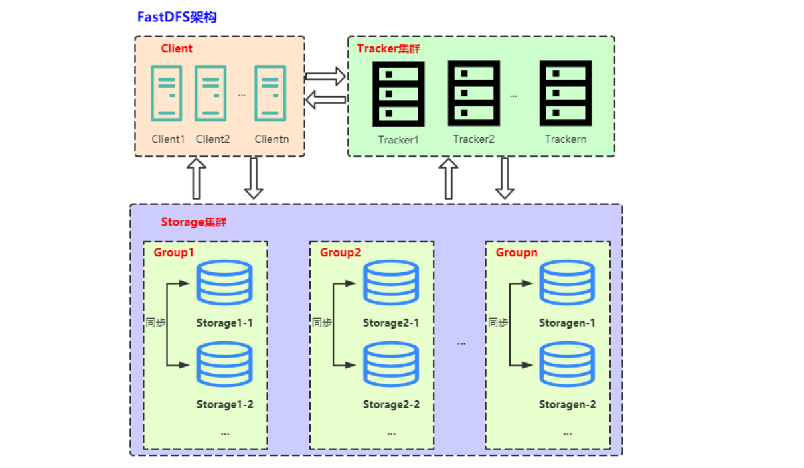

# FastDFS

---

### 一、fastDFS

#### 1.fastDFS概述

fastDFS是c语言编写的一款开源的分布式文件系统（余庆淘宝架构师）。为互联网量身定制，充分考虑了冗余备份、负载均衡、线性扩容等机制，注重高可用、高性能等指标。可以很容易搭建一套高性能的文件服务器集群提供<font color='#BAOC2F'>文件上传、下载</font>等服务。图床、网盘

1. 冗余备份: 纵向扩容
2. 线性扩容: 横向扩容

| fastDFS框架中的三个角色                 | 具体说明           |
| --------------------------------------- | ------------------ |
| 追踪器Tracker - 管理者（守护进程）      | 管理存储节点       |
| 存储节点 - storage（守护进程）          | 存储节点是有多个的 |
| 客户端 - 开发者编写的程序（非守护进程） | 文件上传、文件下载 |

#### 2.fastDFS模块

1. 追踪器：最先启动追踪器

2. 存储节点：第二个启动的角色，存储节点启动之后, 会单独开一个线程

    - 汇报当前存储节点的容量, 和剩余容量
    - 汇报数据的同步情况
    - 汇报数据被下载的次数

3. 客户端：最后启动

    - 上传文件：连接追踪器, 询问存储节点的信息

        - 我要上传1G的文件, 询问那个存储节点有足够的容量

        - 追踪器查询, 得到结果

        - 追踪器将查到的存储节点的 IP + port 发送给客户端

        - 通过得到IP和端口连接存储节点

        - 将文件内容发送给存储节点（Socket通信）

            

    - 下载文件：连接追踪器, 询问存储节点的信息
        - 询问, 要下载的文件在哪一个存储节点

        - 追踪器查询, 得到结果

        - 追踪器将查到的存储节点的 IP + port 发送给客户端

        - 通过得到IP和端口连接存储节点

        - 下载文件（Socket通信）

            

#### 3.fastDFS集群



##### （1）追踪器集群：

为了避免单点故障，可以建立追踪器集群。多个Tracker追踪器通过轮训的方式来进行工作，可以通过修改配置文件的方式实现集群。

##### （2）存储节点集群：

- fastDFS管理存储节点的方式：通过分组的方式完成的
- 集群方式（扩容方式）
  - 横向扩容 - 增加容量
    - 添加一台新的主机 -> 容量增加了
    - 假设当前有两个组: group1, group2，需要添加一个新的分组 -> group3，新主机属于第三组
    - 不同组的<font color='#BAOC2F'>主机之间不需要通信</font>
  - 纵向扩容 - 数据备份
    - 假设当前有两个组: group1, group2
      - 将新的主机放到现有的组中
      - 每个组的主机数量从1 -> n
        - 这n台主机的关系就是相互备份的关系
        - 同一个组中的<font color='#BAOC2F'>主机需要通信</font>
        - 每组的容量 == 容量最小的这台主机

### 二、fastDFS使用

#### 1.fastDFS的安装

- libfastcommon-1.36.zip（fastdfs的基础库）
  - unzip xxx.zip
  - ./make.sh
  - ./make.sh install
- fastdfs-5.10.tar.gz
  - tar zxvf xxx.tar.gz
  - ./make.sh
  - ./make.sh install
- 测试

```shell
#fastDFS安装的所有的可执行程序: 
/usr/bin/fdfs_*
fdfs_test
```

#### 2.fastDFS配置文件

> 配置文件默认位置:  /etc/fdfs，
>
> 文件夹内容：client.conf.sample  storage.conf.sample  storage_ids.conf.sample  tracker.conf.sample

1. tracker 配置文件

   ```shell
   # 将追踪器和部署的主机的IP地址进程绑定, 也可以不指定
   # 如果不指定, 会自动绑定当前主机IP, 如果是云服务器建议不要写
   bind_addr=192.168.247.135
   # 追踪器监听的端口
   port=22122
   # 追踪器存储日志信息的目录, xxx.pid文件, 必须是一个存在的目录
   base_path=/home/yuqing/fastdfs
   ```

2. storage 配置文件

   ```shell
   # 当前存储节点对应的主机属于哪一个组
   group_name=group1
   # 当前存储节点和所应该的主机进行IP地址的绑定, 如果不写, 有fastdfs自动绑定
   bind_addr=
   # 存储节点绑定的端口
   port=23000
   # 存储节点写log日志的路径
   base_path=/home/yuqing/fastdfs
   # 存储节点提供的存储文件的路径个数
   store_path_count=2
   # 具体的存储路径
   store_path0=/home/yuqing/fastdfs
   store_path1=/home/yuqing/fastdfs1
   # 追踪器的地址信息
   tracker_server=192.168.247.135:22122 
   tracker_server=192.168.247.136:22122 
   ```

3. 客户端配置文件

   ```shell
   # 客户端写log日志的目录
   # 该路径必须存在
   # 当前的用户对于该路径中的文件有读写权限
   # 当前用户robin
   # 指定的路径属于root
   base_path=/home/yuqing/fastdfs
   # 要连接的追踪器的地址信息
   tracker_server=192.168.247.135:22122 
   tracker_server=192.168.247.136:22122 
   ```

#### 3.fastDFS的启动

1. 第一个启动追踪器  - 守护进程

   ```shell
   # 启动程序在 /usr/bin/fdfs_*
   # 启动
   fdfs_trackerd 追踪器的配置文件(/etc/fdfs/tracker.conf) 
   # 关闭
   fdfs_trackerd 追踪器的配置文件(/etc/fdfs/tracker.conf)  stop
   # 重启
   fdfs_trackerd 追踪器的配置文件(/etc/fdfs/tracker.conf) restart
   ```

2. 第二个启动存储节点 - 守护进程

   ```shell
   # 启动
   fdfs_storaged 存储节点的配置文件(/etc/fdfs/stroga.conf)
   # 关闭
   fdfs_storaged 存储节点的配置文件(/etc/fdfs/stroga.conf) stop
   # 重启
   fdfs_storaged 存储节点的配置文件(/etc/fdfs/stroga.conf) restart
   ```

3. 最后启动客户端 - 普通进程

   ```shell
   # 上传
   fdfs_upload_file 客户端的配置文件(/etc/fdfs/client.conf) 要上传的文件
   # 得到的结果字符串: group1/M00/00/00/wKj3h1vC-PuAJ09iAAAHT1YnUNE31352.c
   # 下载
   fdfs_download_file 客户端的配置文件(/etc/fdfs/client.conf) 上传成功之后得到的字符串(fileID)
   ```

4. fastDFS状态检测

    ```shell
    fdfs_monitor /etc/fdfs/client.conf
    ```

    ```shell
    # FDFS_STORAGE_STATUS：INIT      :初始化，尚未得到同步已有数据的源服务器
    # FDFS_STORAGE_STATUS：WAIT_SYNC :等待同步，已得到同步已有数据的源服务器
    # FDFS_STORAGE_STATUS：SYNCING   :同步中
    # FDFS_STORAGE_STATUS：DELETED   :已删除，该服务器从本组中摘除
    # FDFS_STORAGE_STATUS：OFFLINE   :离线
    # FDFS_STORAGE_STATUS：ONLINE    :在线，尚不能提供服务
    # FDFS_STORAGE_STATUS：ACTIVE    :在线，可以提供服务
    ```

> Storage Server的7种状态：https://blog.csdn.net/u014723529/article/details/46048411

#### 4.对file_id的解释


- group1
  - 文件上传到了存储节点的哪一个组
  - 如果有多个组这个组名可变的
- M00 - 虚拟目录
  - 和存储节点的配置项有映射

    store_path0=/home/yuqing/fastdfs/data    ->  M00
    store_path1=/home/yuqing/fastdfs1/data   -> M01
- 00/00
  - 实际的路径
  - 可变的
- wKhS_VlrEfOAdIZyAAAJTOwCGr43848.md
  - 文件名包含的信息
  - 采用Base64编码：包含的字段包括
    - 源storage server Ip 地址  
    - 文件创建时间  

    - 文件大小  

    - 文件CRC32效验码 ：循环冗余校验  

    - 随机数

### 三、上传下载代码实现

#### 1.使用多进程方式实现


获取最终上传的文件id：file_id的程序，

- exec函数族函数

  - execl
  - execlp
- 子进程 -> 执行execlp("fdfs_upload_file" , "xx", arg, NULL), 有结果输出, 输出到终端

  - 不让它写到终端 -> 重定向dup2(old, new)，old-> 标准输出、new -> 管道的写端
  - 文件描述符
  - 数据块读到内存 -> 子进程
  - 数据最终要给到父进程
  - 进程间通信：pipe -> 读端, 写端
  - 在子进程创建之前创建就行了
- 父进程

    - 读管道 -> 内存
    - 内存数据写入数据库

#### 2.使用fastDFS 提供的API实现

将fastDFS 提供的API，针对业务进行修改实现文件的上传操作，客户端实现代码如下：

<mark>程序思路</mark>：

1. 创建管道 - pipe

2. 创建子进程

    - 子进程写管道, 关闭读端

    - 将标准输出 -> 管道的写端

    - 重定向
    - 执行execl命令, 调用另外的进程fdfs_upload_file
    - 子进程退出

3. 父进程

    - 读管道， 关闭写端
    - 释放子进程资源 - pcb
    - wait()/ waitpid()

```c
#include <stdio.h>
#include <stdlib.h>
#include <string.h>
#include <string.h>
#include <errno.h>
#include <sys/types.h>
#include <sys/stat.h>
#include <fcntl.h>
#include <sys/wait.h>
#include "fdfs_client.h"
#include "fdfs_upload_file.h"

int upload_file1(const char *conf_filename, const char* filename, char *file_id) {
	char group_name[FDFS_GROUP_NAME_MAX_LEN + 1];
	ConnectionInfo *pTrackerServer;
	int result;
	int store_path_index;
	ConnectionInfo storageServer;

	if ((result=fdfs_client_init(conf_filename)) != 0) return result;

	pTrackerServer = tracker_get_connection();
	if (pTrackerServer == NULL) {
		fdfs_client_destroy();
		return errno != 0 ? errno : ECONNREFUSED;
	}

	*group_name = '\0';

	if ((result=tracker_query_storage_store(pTrackerServer, &storageServer, group_name, &store_path_index)) != 0) {
		fdfs_client_destroy();
		fprintf(stderr, "tracker_query_storage fail, " "error no: %d, error info: %s\n", result, STRERROR(result));
		return result;
	}

	result = storage_upload_by_filename1(pTrackerServer, &storageServer, store_path_index, filename, NULL, NULL, 0, group_name, file_id);
	if (result == 0) {
		printf("%s\n", file_id);
	} else {
		fprintf(stderr, "upload file fail, " "error no: %d, error info: %s\n", result, STRERROR(result));
	}

	tracker_disconnect_server_ex(pTrackerServer, true);
	fdfs_client_destroy();

	return result;
}

int upload_file2(const char *conf_filename, const char* filename, char *file_id, int size) {
    //1.创建命名管道
    int fd[2];
    int ret = pipe(fd);
    if (ret == -1) {
        perror("pipe");
        exit(0);
    }

    //2.创建子进程
    pid_t pid = fork();
    if (pid == 0) {
        //(1)标准输出重定向 -> 管道的写入端
        dup2(fd[1], STDOUT_FILENO);
        //(2)关闭读端
        close(fd[0]);
        //(3)执行命令
        execlp("fdfs_upload_file", "xxx", conf_filename, filename, NULL);
        perror("execlp");
    } else {
        //(1)读管道
        close(fd[1]);
        read(fd[0], file_id, size);
        //(2)回收pcb->子进程
        wait(NULL);
    }
}
```

### 补充：Linux下进行源码安装

1. 找可执行文件 <font color=green>configure</font>
   - 执行这个可执行文件
     - 检测安装环境
     - 生成 makefile
2. 执行make命令
   - 编译源代码
     - 生成动态库
     - 生成静态库
     - 可执行程序
3. 安装 make install (需要管理员权限)
   - 将第三步生成的动态库/动态库/可执行程序拷贝到对应的系统目录


