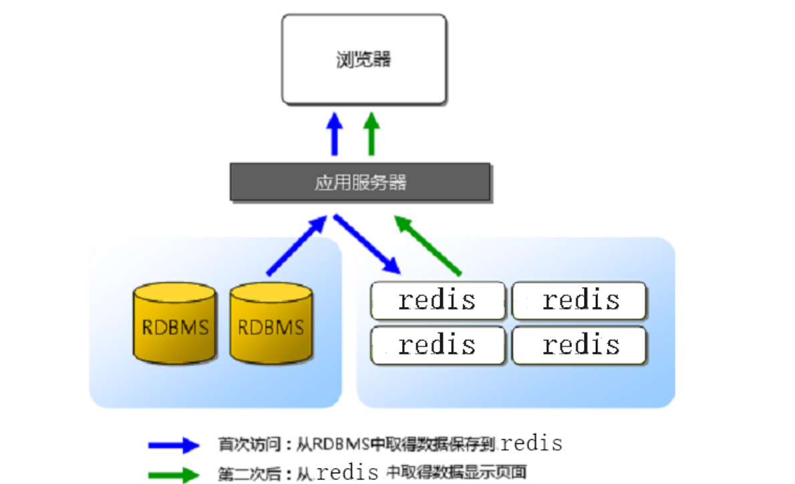
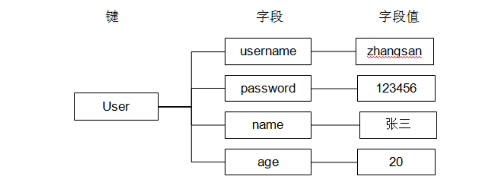

##  1. 数据库类型

### 1.1 基本概念

1. 关系型数据库 - sql
   - 操作数据必须要使用sql语句
   - 数据存储在磁盘
   - 存储的数据量大
   - 举例:
     - mysql
     - oracle
     - sqlite - 文件数据库
     - sql server
2. 非关系数据库 - nosql
   - 操作不使用sql语句
     - 命令
   - 数据默认存储在内存
     - 速度快, 效率高
     - 存储的数据量小
   - 不需要数据库表
     - 以键值对的方式存储的

### 1.2 关系/非关系型数据库搭配使用



> ==RDBMS: Relational Database Management System==
>
> 1. 所有的数据默认存储在关系型数据库中
> 2. 客户端访问服务器, 有一些数据, 服务器需要频繁的查询数据
>    - 服务器首先将数据从关系型数据库中读出 -> 第一次
>      - 将数据写入到redis中
>    - 客户端第二次包含以后访问服务器
>      - 服务器从redis中直接读数据

## 2. Redis

> 1. 知道redis是什么?
>    - 非关系型数据库 也可以叫 内存数据库
> 2. 能干什么?
>    - 存储访问频率高的数据
>    - 共享内存
>      - 服务器端 -> redis
> 3. 怎么使用?
>    - 常用的操作命令
>      - 各种数据类型 -> 会查
>    - redis的配置文件
>    - redis的数据持久化
>    - 写程序的时候如何对redis进行操作
>      - 客户端 -> 服务器

### 2.1 基本知识点

1. 安装包下载
   - 英文官方： <https://redis.io/>
   - 中文官方： <http://redis.cn/>

2. Redis安装

   - make
   - make install

3. redis中的两个角色

   ```shell
   # 服务器 - 启动
   redis-server	# 默认启动
   redis-server confFileName # 根据配置文件的设置启动
   # 客户端
   redis-cli	# 默认连接本地, 绑定了6379默认端口的服务器
   redis-cli -p 端口号
   redis-cli -h IP地址 -p 端口 # 连接远程主机的指定端口的redis
   # 通过客户端关闭服务器
   shutdown
   # 客户端的测试命令
   ping [MSG]
   ```

4. redis中数据的组织格式

   - 键值对
     - key: 必须是字符串 - "hello"
     - value: 可选的
       - String类型
       - List类型
       - Set类型
       - SortedSet类型
       - Hash类型

5. redis中常用数据类型
   - String类型
     - 字符串
   - List类型
     - 存储多个string字符串的
   - Set类型
     - 集合
       - stl集合
         - 默认是排序的, 元素不重复
       - redis集合
         - 元素不重复, 数据是无序的
   - SortedSet类型
     - 排序集合, 集合中的每个元素分为两部分
       - [分数, 成员] -> [66, ''tom'']
   - Hash类型
     - 跟map数据组织方式一样: key:value
       - Qt -> QHash, QMap
       - Map -> 红黑树
       - hash -> 数组
         - a[index] = xx

### 2.2 redis常用命令

- String类型

  ```shell
  key -> string
  value -> string
  # 设置一个键值对->string:string
  SET key value
  # 通过key得到value
  GET key
  # 同时设置一个或多个 key-value 对
  MSET key value [key value ...]
  # 同时查看过个key
  MGET key [key ...]
  # 如果 key 已经存在并且是一个字符串， APPEND 命令将 value 追加到 key 原来的值的末尾
  # key: hello, value: world, append: 12345
  APPEND key value
  # 返回 key 所储存的字符串值的长度
  STRLEN key
  # 将 key 中储存的数字值减一。
  # 前提, value必须是数字字符串 -"12345"
  DECR key
  ```

- List类型 - 存储多个字符串

  ```shell
  key -> string
  value -> list
  # 将一个或多个值 value 插入到列表 key 的表头
  LPUSH key value [value ...]
  # 将一个或多个值 value 插入到列表 key 的表尾 (最右边)。
  RPUSH key value [value ...]
  # list中删除元素
  LPOP key # 删除最左侧元素
  RPOP key # 删除最右侧元素
  # 遍历
  LRANGE key start stop
  	start: 起始位置, 0
  	stop: 结束位置, -1
  # 通过下标得到对应位置的字符串
  LINDEX key index
  # list中字符串的个数
  LLEN key
  ```

- Set类型

  ```shell
  key -> string
  value -> set类型 ("string", "string1")
  # 添加元素
  # 将一个或多个 member 元素加入到集合 key 当中，已经存在于集合的 member 元素将被忽略
  SADD key member [member ...]
  # 遍历
  SMEMBERS key
  # 差集
  SDIFF key [key ...]
  # 交集
  SINTER key [key ...]
  # 并集
  SUNION key [key ...]
  ```

- SortedSet 类型

  ```shell
  key -> string
  value -> sorted ([socre, member], [socre, member], ...)
  # 添加元素
  ZADD key score member [[score member] [score member] ...]
  # 遍历
  ZRANGE key start stop [WITHSCORES] # -> 升序集合
  ZREVRANGE key start stop [WITHSCORES] # -> 降序集合
  # 指定分数区间内元素的个数
  ZCOUNT key min max
  ```

- Hash类型

  

  ```shell
  key ->string
  value -> hash ([key:value], [key:value], [key:value], ...)
  # 添加数据
  HSET key field value
  # 取数据
  HGET key field
  # 批量插入键值对
  HMSET key field value [field value ...]
  # 批量取数据
  HMGET key field [field ...]
  # 删除键值对
  HDEL key field [field ...]
  ```

- Key 相关的命令

  ```shell
  # 删除键值对
  DEL key [key ...]
  # 查看key值
  KEYS pattern
  查找所有符合给定模式 pattern 的 key 。
  KEYS * 匹配数据库中所有 key 。
  KEYS h?llo 匹配 hello ， hallo 和 hxllo 等。
  KEYS h*llo 匹配 hllo 和 heeeeello 等。
  KEYS h[ae]llo 匹配 hello 和 hallo ，但不匹配 hillo
  # 给key设置生存时长
  EXPIRE key seconds
  # 取消生存时长
  PERSIST key
  # key对应的valued类型
  TYPE key
  ```


### 2.3 redis配置文件

> 配置文件是给**redis服务器**使用 的

1. 配置文件位置

   - 从源码安装目录中找 -> redis.conf

2. 配置文件配置项

   ```shell
   # redis服务器绑定谁之后, 谁就能访问redis服务器
   # 任何客户端都能访问服务器, 需要注释该选项
   bind 127.0.0.1 192.168.1.100 
   # 保护模式, 如果要远程客户端访问服务器, 该模式要关闭
   protected-mode yes
   # reids服务器启动时候绑定的端口, 默认为6379
   port 6379
   # 超时时长, 0位关闭该选项, >0则开启
   timeout 0
   # 服务器启动之后不是守护进程
   daemonize no
   # 如果服务器是守护进程, 就会生成一个pid文件
   # ./ -> reids服务器启动时候对应的目录
   pidfile ./redis.pid
   # 日志级别
    loglevel notice
   # 如果服务器是守护进程, 才会写日志文件
    logfile "" -> 这是没写
    logfile ./redis.log
    # redis中数据库的个数
    databases 16 
    	- 切换 select dbID [dbID == 0 ~ 16-1]
   ```

### 2.4 redis数据持久化

> 持久化: 数据从内存到磁盘的过程

持久化的两种方式:

- rdb方式
  - 这是一种默认的持久化方式, 默认打开
  - 磁盘的持久化文件xxx.rdb
  - 将内存数据以二进制的方式直接写入磁盘文件
  - 文件比较小, 恢复时间短, 效率高
  - 以用户设定的频率 -> 容易丢失数据
  - 数据完整性相对较低
- aof方式
  - 默认是关闭的
  - 磁盘的持久化文件xxx.aof
  - 直接将生成数据的命令写入磁盘文件
  - 文件比较大, 恢复时间长, 效率低
  - 以某种频率 -> 1sec
  - 数据完整性高

```shell
# rdb的同步频率, 任意一个满足都可以
save 900 1
save 300 10
save 60 10000
# rdb文件的名字
dbfilename dump.rdb
# 生成的持久化文件保存的那个目录下, rdb和aof
dir ./ 
# 是不是要打开aof模式
appendonly no
 -> 打开: yes
# 设置aof文件的名字
appendfilename "appendonly.aof"
# aof更新的频率
# appendfsync always
appendfsync everysec
# appendfsync no
```

1. aof和rdb能不能同时打开?

   - 可以

2. aof和rdb能不能同时关闭?

   - 可以

   - rdb如何关闭?

     ```shell
     save ""
     ```

3. 两种模式同时开启, 如果要进行数据恢复, 如何选择?

   - 效率上考虑:  rdb模式
   - 数据的完整性: aof模式

## 3 hiredis的使用

1. hiredis的安装

   - 下载地址: <http://redis.cn/clients.html#c> 
   - 安装
     - make
     - make 

2. hiredis API接口的使用

   - 连接数据库

     ```c
     // 连接数据库
     redisContext *redisConnect(const char *ip, int port);
     redisContext *redisConnectWithTimeout(const char *ip, 
                                           int port, const struct timeval tv);
     ```

   - 执行redis命令函数

     ```c
     // 执行redis命令
     void *redisCommand(redisContext *c, const char *format, ...);
     // redisCommand 函数实际的返回值类型
     typedef struct redisReply {
         /* 命令执行结果的返回类型 */
         int type; 
         /* 存储执行结果返回为整数 */
         long long integer;
         /* str变量的字符串值长度 */
         size_t len;
         /* 存储命令执行结果返回是字符串, 或者错误信息 */
         char *str;
         /* 返回结果是数组, 代表数据的大小 */
         size_t elements;
         /* 存储执行结果返回是数组*/
         struct redisReply **element;
     } redisReply;
     redisReply a[100];
     element[i]->str
     ```

     | 状态表示                 | 含义                                                         |
     | ------------------------ | ------------------------------------------------------------ |
     | REDIS_REPLY_STRING==1    | 返回值是字符串,字符串储存在redis->str当中,字符串长度为redi   |
     | REDIS_REPLY_ARRAY== 2    | 返回值是数组，数组大小存在redis->elements里面，数组值存储在redis->element[i]里面。数组里面存储的是指向redisReply的指针，数组里面的返回值可以通过redis->element[i]->str来访问，数组的结果里全是type==REDIS_REPLY_STRING的redisReply对象指针。 |
     | REDIS_REPLY_INTEGER == 3 | 返回整数long long，从integer字段获取值                       |
     | REDIS_REPLY_NIL==4       | 返回值为空表示执行结果为空                                   |
     | REDIS_REPLY_STATUS ==5   | 返回命令执行的状态，比如set foo bar 返回的状态为OK，存储在str当中 reply->str == "OK" 。 |
     | REDIS_REPLY_ERROR ==6    | 命令执行错误,错误信息存放在 reply->str当中。                 |

   - 释放资源

     ```c
     // 释放资源
     void freeReplyObject(void *reply);
     void redisFree(redisContext *c);
     ```


## 4. 复习

1. fastDFS

   - 是什么?

     - 分布式文件系统

   - 干什么?

     - 提供文件上传
     - 提供文件下载

   - 怎么使用?

     - 根据主机的角色 -> 修改对应的配置文件

     - 启动各个角色

       ```shell
       fdfs_trackerd /etc/fdfs/tracker.conf
       fdfs_storaged /etc/fdfs/storage.conf
       ```

 


     客户端编写
    
     - 操作步骤
    
       1. 创建管道 - pipe
       2. 创建子进程
       3. 子进程干什么?
    
          - 写管道, 关闭读端
            - 将标准输出 -> 管道的写端
          - 重定向
          - 执行execl命令, 调用另外的进程fdfs_upload_file
          - 子进程退出
       4. 父进程？
          - 读管道， 关闭写端
          - 释放子进程资源 - pcb
            - wait()/ waitpid()
