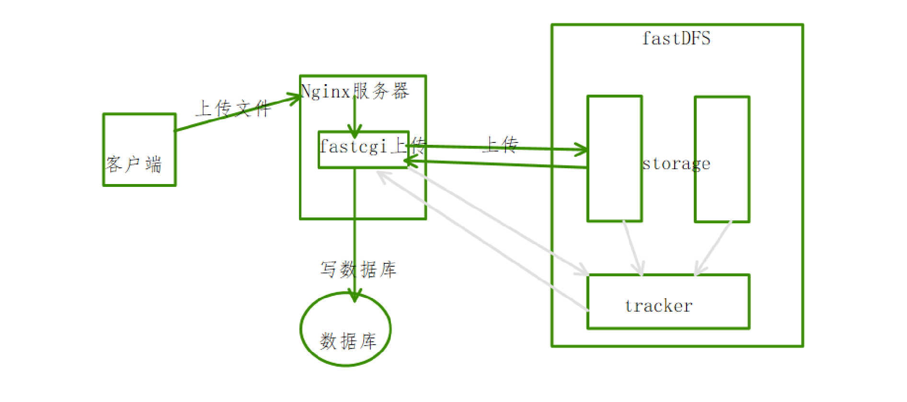
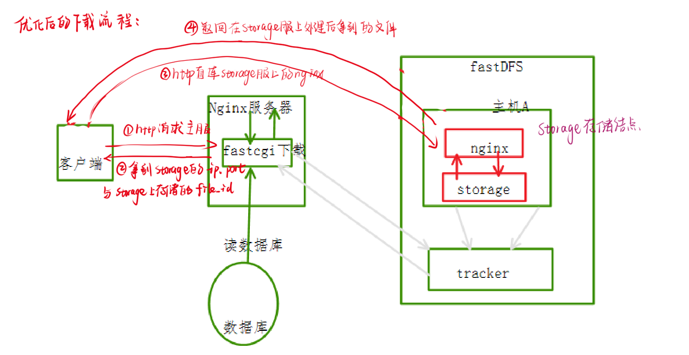

# 上传下载

---

### 一、文件上传下载流程

#### 1.上传流程



1. fastcgi进程循环读文件数据
2. 将读取到的文件写入磁盘（临时文件）
3. 将磁盘中的临时文件数据，上传到fastDFS存储结点，得到file_id
4. 将得到的file_id写入到数据库中，file_id与文件系统中存储的文件对应
5. 删除磁盘临时文件，

#### 2.下载流程方案1


1. 客户端将下载请求发送给nginx，nginx将请求转发给对应下载请求的fastcgi进程，
2. fastcgi进程查询数据库，的到file_id
3. 服务器连接fastDFS，根据file_id下载文件到服务器磁盘中（临时文件）
4. 服务器将文件发送给客户端

#### 3.下载流程方案2

为了提高访问速度在方案1的基础上修改：直接让客户端连接fastDFS的存储节点, 实现文件下载

1. <mark>问题1</mark>：客户端发送请求使用http协议直连storage服务器，fastDFS(TCP套接字通信)显然不能解析http协议，如何解决？
    - 在storage服务器上安装nginx，由nginx解析http协议，
    - 在storage服务器上安装fastDFS插件对nginx解析的数据进行处理，从而能够连接storage存储结点
2. <mark>问题2</mark>：客户端怎么知道文件就存储在哪个对应的存储节点上?
    - 上传的时候将fileID和存储节点IP地址都进行存储



### 二、存储结点安装Nginx+fastDFS

有分析可知采用下载流程方案2：在存储结点安装Nginx与fastDFS插件，实现用户直接从存储结点上下载文件。

在存储节点上安装Nginx与fastDFS（在存储节点上安装Nginx, 将软件安装包拷贝到fastDFS存储节点对应的主机上），进行交叉编译后的Nginx无法正常工作，会出现各种问题需要对程序进行修改，

```shell
# 1. 找fastDFS的存储节点
# 2. 在存储节点对应的主机上安装Nginx, 安装的时候需要一并将fastDFS插件装上
#	- (余庆提供插件的代码 + nginx的源代码) * 交叉编译 = Nginx  
```

#### 1.存储节点主机Nginx

- step1：在存储节点对应的主机上安装Nginx, 作为web服务器


```shell
- fastdfs-nginx-module_v1.16.tar.gz 解压缩
# 1. 进入nginx的源码安装目录
# 2. 检测环境, 生成makefile
./configure --add-module=fastdfs插件的源码目录/src --with-openssl=../openssl-1.0.1t --with-pcre=../pcre-8.40 --with-zlib=../zlib-1.2.11
make
sudo make install
```

```shell
# make过程中的错误:
# 1. fatal error: fdfs_define.h: No such file or directory
# 2. fatal error: common_define.h: No such file or directory

default:    build

clean:
    rm -rf Makefile objs

build:
    $(MAKE) -f objs/Makefile

install:
    $(MAKE) -f objs/Makefile install

modules:
    $(MAKE) -f objs/Makefile modules

upgrade:
    /usr/local/nginx/sbin/nginx -t

    kill -USR2 `cat /usr/local/nginx/logs/nginx.pid`
    sleep 1
    test -f /usr/local/nginx/logs/nginx.pid.oldbin

    kill -QUIT `cat /usr/local/nginx/logs/nginx.pid.oldbin`
# 解决方案 - 修改objs/Makefile
ALL_INCS = -I src/core \
    -I src/event \
    -I src/event/modules \
    -I src/os/unix \
    -I /usr/local/include/fastdfs \
    -I /usr/local/include/fastcommon/ \
    -I objs \
    -I src/http \                                                                                                  
    -I src/http/modules\
    -I /usr/include/fastdfs/
```

安装成功, 启动Nginx, 发现没有 worker进程

```shell
robin@OS:/usr/local/nginx/sbin$ ps aux|grep nginx
root      65111  0.0  0.0  39200   696 ?Ss   10:32   0:00 nginx: master process ./nginx
robin     65114  0.0  0.0  16272   928 pts/9  S+   10:32   0:00 grep --color=auto nginx
```

#### 2.mod_fastdfs.conf

找nginx的logs日志

```shell
# ERROR - file: shared_func.c, line: 968, file /etc/fdfs/mod_fastdfs.conf not exist
# 从哪儿找 -> fastDFS插件目录中找
robin@OS:~/package/nginx/fastdfs-nginx-module/src$ tree
.
├── common.c
├── common.h
├── config
├── mod_fastdfs.conf   -> cp /etc/fdfs
└── ngx_http_fastdfs_module.c
```

需要修改mod_fdfs.conf文件, 参数当前存储节点的storage.conf进行修改

   ```shell
   # 存储log日志的目录
   base_path=/home/robin/fastdfs/storage
   # 连接tracker地址信息
   tracker_server=192.168.247.135:22122
   # 存储节点绑定的端口
   storage_server_port=23000
   # 当前存储节点所属的组
   group_name=group1
   # 客户端下载文件的时候, 这个下载的url中是不是包含组的名字
   url_have_group_name = true
   // 上传的fileID: group1/M00/00/00/wKj3h1vJRPeAA9KEAAAIZMjR0rI076.cpp
   // 完整的url: http://192.168.1.100/group1/M00/00/00/wKj3h1vJRPeAA9KEAAAIZMjR0rI076.cpp
   # 存储节点上存储路径的个数
   store_path_count=1
   # 存储路径的详细信息
   store_path0=/home/robin/fastdfs/storage
   ```

#### 3.http.conf&mime.types

重启动Nginx, 还是没有worker进程, 查看log日志


```shell
# ERROR - file: ini_file_reader.c, line: 631, include file "http.conf" not exists, line: "#include http.conf"
从 /etc/fdfs 下找的时候不存在
	- 从fastDFS源码安装目录找/conf
	- sudo cp http.conf /etc/fdfs
# ERROR - file: shared_func.c, line: 968, file /etc/fdfs/mime.types not exist
	- 从nginx的源码安装包中找/conf
	- sudo cp mime.types /etc/fdfs
```

在多次修改后，重启动Nginx, worker进程成功启动：


#### 4.测试

通过浏览器请求服务器下载文件: 404 Not Found

```cpp
http://192.168.172.132/group1/M00/00/00/wKishGQ3tAWAIpTXAAABeipJJbc065.cpp
# 错误信息
open() "/usr/local/nginx/zyFile2/group1/M00/00/00/wKishGQ3tAWAIpTXAAABeipJJbc065.cpp" failed (2: No such file or directory), client: 192.168.172.1, server: localhost, request: "
GET /group1/M00/00/00/wKishGQ3tAWAIpTXAAABeipJJbc065.cpp HTTP/1.1", host: "192.168.172.132"
    
服务器在查找资源时候, 找的位置不对, 需要给服务器指定一个正确的位置：
- 资源所在目录： 在存储节点的存储目录中 store_path0
- 告诉服务器资源的位置 在服务器端添加location处理
locatioin /group1/M00/00/00/wKj3h1vJSOqAM6RHAAvqH_kipG8229.jpg
location /group1/M00/00/00/
location /group1/M00/
location /group1/M00/
{
	# 告诉服务器资源的位置
	root /home/robin/fastdfs/storage/data;
	ngx_fastdfs_module;//余庆负责
}
```


### 三、数据库环境搭建

创建一个名称为cloud_disk的数据库 

```mysql
CREATE DATABASE cloud_disk;
```

#### 1.用户信息表user

| 字段           | 解释                     |
| -------------- | ------------------------ |
| userid（主键） | 用户序号，自动递增，主键 |
| name           | 用户名字                 |
| nickname       | 用户昵称                 |
| phone          | 手机号码                 |
| email          | 邮箱                     |
| password       | 密码                     |
| createtime     | 时间                     |

```mysql
CREATE TABLE user (
    id BIGINT NOT NULL PRIMARY KEY AUTO_INCREMENT,
    name VARCHAR (128) NOT NULL,
    nickname VARCHAR (128) NOT NULL,
    password VARCHAR (128) NOT NULL,
    phone VARCHAR (15) NOT NULL,
    createtime VARCHAR (128),
    email VARCHAR (100),
    CONSTRAINT uq_nickname UNIQUE (nickname),
    CONSTRAINT uq_name UNIQUE (NAME)
);
```

#### 2.文件信息表user_file_list

| 字段        | 解释                                                         |
| ----------- | :----------------------------------------------------------- |
| md5（主键） | 文件md5, 识别文件的唯一表示（文件哈希值防止重复）            |
| file_id     | 文件id-/group1/M00/00/00/xxx.png                             |
| url         | 文件url 192.168.1.2:80/group1/M00/00/00/xxx.png - 下载的时候使用 |
| fileName    | 文件名                                                       |
| size        | 文件大小, 以字节为单位                                       |
| type        | 文件类型： png, zip, mp4……                                   |
| count       | 文件引用计数， 默认为1    每增加一个用户拥有此文件，此计数器+1（文件只存储一份、不要重复相同文件存储） |

```mysql
CREATE TABLE user_file_list (
    user VARCHAR (128) NOT NULL,
    md5 VARCHAR (200) NOT NULL,
    createtime VARCHAR (128),
    filename VARCHAR (128),
    shared_status INT,
    pv INT
);
```

#### 3.用户文件列表user_file_list

| 字段          | 解释                               |
| ------------- | ---------------------------------- |
| userid        | 文件所属用户                       |
| md5           | 文件md5                            |
| createtime    | 文件创建时间                       |
| filename      | 文件名字                           |
| shared_status | 共享状态, 0为没有共享， 1为共享    |
| pv            | 文件下载量，默认值为0，下载一次加1 |

```mysql
CREATE TABLE user_file_list (
    user VARCHAR (128) NOT NULL,
    md5 VARCHAR (200) NOT NULL,
    createtime VARCHAR (128),
    filename VARCHAR (128),
    shared_status INT,
    pv INT
);
```

#### 4.用户文件数量表user_file_count

| 字段   | 解释           |
| ------ | -------------- |
| userid | 文件所属用户   |
| count  | 拥有文件的数量 |

```mysql
CREATE TABLE user_file_count (
    user VARCHAR (128) NOT NULL PRIMARY KEY,
    count INT
);
```

#### 5.共享文件列表share_file_list

| 字段       | 解释                               |
| ---------- | ---------------------------------- |
| userid     | 文件所属用户                       |
| md5        | 文件md5                            |
| createtime | 文件共享时间                       |
| filename   | 文件名字                           |
| pv         | 文件下载量，默认值为1，下载一次加1 |

```mysql
CREATE TABLE share_file_list (
    user VARCHAR (128) NOT NULL,
    md5 VARCHAR (200) NOT NULL,
    createtime VARCHAR (128),
    filename VARCHAR (128),
    pv INT
);
```


