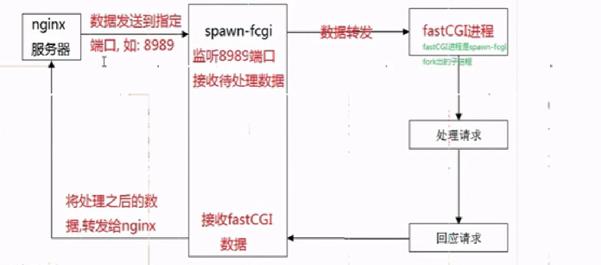
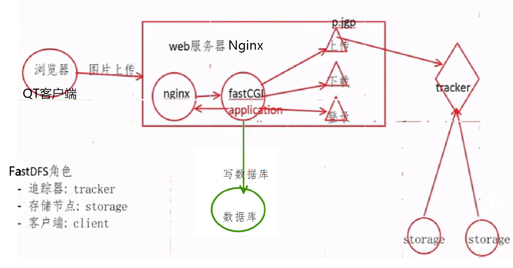
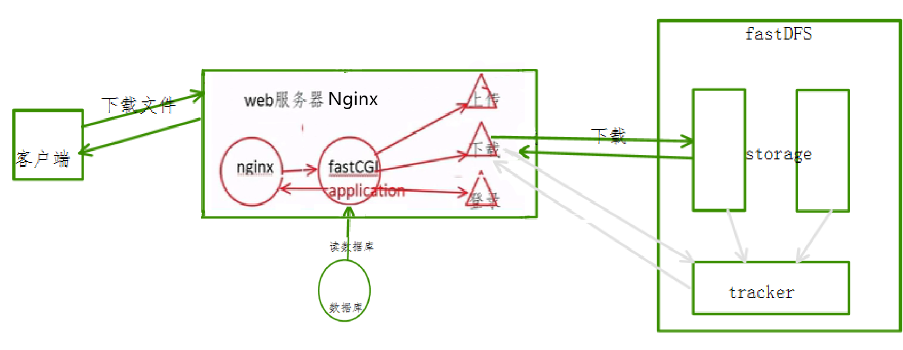

# 上传下载

---

### 一、文件上传下载流程

#### 1.上传流程

nginx无法处理的指令则交给fastcgi处理，而fastcgi是由开发者编写的应用程序（application），

- 数据需要转发，

- 数据需要转发到指定的端口：在nginx中进行配置fastcgi模块，将数据发送到指定的端口

    ```nginx
    location /login {
        fastcgi_pass 127.0.0.1:9000;
        include fastcgi.conf;
    }
    ```

- 使用fastcgi处理指令请求，

    ```
    spawn-fcgi -a [IP地址] -p [端口] -f [fastcgi程序]
    ```





1. fastcgi进程循环读文件数据
2. 将读取到的文件写入磁盘（临时文件）
3. 将磁盘中的临时文件数据，上传到fastDFS存储结点，得到file_id
4. 将得到的file_id写入到数据库中，file_id与文件系统中存储的文件对应
5. 删除磁盘临时文件，

#### 2.下载流程1



具体的下载流程：

1. 客户端将下载请求发送给nginx，nginx将请求转发给对应下载请求的fastcgi进程，
2. fastcgi进程查询数据库，得到file_id
3. 服务器连接fastDFS，根据file_id下载文件到服务器磁盘中（临时文件）
    - cgi程序访问tracker结点，tracker会向服务器返回提供storage的ip地址与端口号port
    - cgi程序根据ip地址与端口号访问storage结点，将文件数据下载到服务器上，

4. 服务器将文件发送给客户端，

#### 3.下载流程2

为了提高访问速度进行的修改：直接让<font color='#BAOC2F'>客户端替代fastcgi程序去连接fastDFS的storage存储节点,</font> 实现文件下载

1. <mark>问题1</mark>：客户端发送请求使用http协议直连storage服务器，fastDFS(TCP套接字通信)显然不能解析http协议，如何解决？
    - 在storage服务器上安装nginx，由nginx解析http协议，
    - 在storage服务器上安装fastDFS插件对nginx解析的数据进行处理，从而能够连接storage存储结点
2. <mark>问题2</mark>：客户端怎么知道文件就存储在哪个对应的存储节点上?
    - 上传的时候将fileID和存储节点IP地址都进行存储，


具体的下载流程：

1. 客户端将下载请求发送给nginx，nginx将请求转发给对应下载请求的fastcgi进程，
2. fastcgi进程查询数据库，得到file_id、存储结点的ip地址与port端口号
3. 客户端根据ip地址与端口号访问fastDFS中对应的存储结点，将文件数据下载到客户端上，

### 二、存储结点安装Nginx+fastDFS

一下是在存储结点上安装Nginx+fastDFS，以及安装过程中的问题排查：

由分析可知采用下载流程方案2：<font color='#BAOC2F'>在存储结点安装Nginx（并在Nginx中安装fastDFS插件）</font>，实现用户直接从存储结点上下载文件。

在存储节点上安装Nginx与fastDFS（在存储节点上安装Nginx, 将软件安装包拷贝到fastDFS存储节点对应的主机上），进行交叉编译后的Nginx无法正常工作，会出现各种问题需要对程序进行修改，

```shell
# 1. 找fastDFS的存储节点
# 2. 在存储节点对应的主机上安装Nginx, 安装的时候需要一并将fastDFS插件装上
#	- (余庆提供插件的代码 + nginx的源代码) * 交叉编译 = Nginx  
```

#### 1.存储节点主机安装Nginx

- step1：在存储节点对应的主机上安装Nginx, 作为web服务器


```shell
- fastdfs-nginx-module_v1.16.tar.gz 下载并解压缩
# 1. 进入nginx的源码安装目录
# 2. 检测环境, 生成makefile
./configure --add-module=fastdfs插件的源码目录/src --with-openssl=../openssl-1.0.1t --with-pcre=../pcre-8.40 --with-zlib=../zlib-1.2.11
make
sudo make install
```

`+ ngx_http_fastdfs_module was configured.` 

```shell
# make过程中的错误:
# 1. fatal error: fdfs_define.h: No such file or directory
# 2. fatal error: common_define.h: No such file or directory

default:    build

clean:
    rm -rf Makefile objs

build:
    $(MAKE) -f objs/Makefile

install:
    $(MAKE) -f objs/Makefile install

modules:
    $(MAKE) -f objs/Makefile modules

upgrade:
    /usr/local/nginx/sbin/nginx -t

    kill -USR2 `cat /usr/local/nginx/logs/nginx.pid`
    sleep 1
    test -f /usr/local/nginx/logs/nginx.pid.oldbin

    kill -QUIT `cat /usr/local/nginx/logs/nginx.pid.oldbin`
# 解决方案 - 修改objs/Makefile
ALL_INCS = -I src/core \
    -I src/event \
    -I src/event/modules \
    -I src/os/unix \
    -I /usr/local/include/fastdfs \
    -I /usr/local/include/fastcommon/ \
    -I objs \
    -I src/http \                                                                                                  
    -I src/http/modules\
    -I /usr/include/fastdfs/ # 新增头文件引用目录
```

安装成功, 启动Nginx, 利用`ps aux|grep nginx`命令查看nginx相关进程，发现nginx只有master进程没有worker进程，

```shell
robin@OS:/usr/local/nginx/sbin$ ps aux|grep nginx
root      65111  0.0  0.0  39200   696 ?Ss   10:32   0:00 nginx: master process ./nginx
robin     65114  0.0  0.0  16272   928 pts/9  S+   10:32   0:00 grep --color=auto nginx
```

#### 2.mod_fastdfs.conf

为了检查为什么worker进程没有启动，开始查找nginx的logs日志，发现nginx错误日志如下：

```nginx
# ERROR - file: shared_func.c, line: 968, file /etc/fdfs/mod_fastdfs.conf not exist
```

```shell
# mod_fastdfs.conf文件上哪儿找? -> fastDFS插件目录中找
robin@OS:~/package/nginx/fastdfs-nginx-module/src$ tree
.
├── common.c
├── common.h
├── config
├── mod_fastdfs.conf   -> cp /etc/fdfs
└── ngx_http_fastdfs_module.c
```

需要修改mod_fdfs.conf文件, 参数当前存储节点的storage.conf进行修改

   ```shell
   # 配置存储结点的log日志存储位置
   base_path=/home/user/fastdfs/storage
   # 连接tracker地址信息 ip + port
   tracker_server=192.168.247.135:22122
   # 存储节点绑定的端口 需要与存储结点的端口对应上
   storage_server_port=23000
   # 当前存储节点所属的组
   group_name=group1
   # 客户端下载文件的时候, 下载的url中是否包含组的名字
   url_have_group_name = true
   # 上传的fileID: group1/M00/00/00/wKj3h1vJRPeAA9KEAAAIZMjR0rI076.cpp
   # 完整的url: http://192.168.1.100/group1/M00/00/00/wKj3h1vJRPeAA9KEAAAIZMjR0rI076.cpp
   # 存储节点上存储路径的个数
   store_path_count=1
   # 存储路径的详细信息（真实的存储位置）
   store_path0=/home/user/fastdfs/storage
   # store_path1=/home/user/fastdfs/storage
   # store_path2=/home/user/fastdfs/storage
   # 整个的fastDFS文件系统一共有多少个组
   group_count=1
   # 配置每个组的信息
   [group1]
   group_name=group1
   storage_server_port=23000
   storage_path_count=1
   storage_path0=/home/user/fastdfs
   # storage_path0=/home/user/fastdfs
   ```

#### 3.http.conf&mime.types

重启动Nginx，`ps aux|grep nginx`发现还是没有worker进程，再次查看log日志查找问题：

从 /etc/fdfs 下找的时候不存在：

```nginx
# ERROR - file: ini_file_reader.c, line: 631, include file "http.conf" not exists, line: "#include http.conf"
```


```shell
- 从fastDFS源码安装目录的/conf配置文件夹中寻找http.conf
- sudo cp http.conf /etc/fdfs
```

```nginx
# ERROR - file: shared_func.c, line: 968, file /etc/fdfs/mime.types not exist
```

```shell
- 从nginx的源码安装包中找/conf
- sudo cp mime.types /etc/fdfs
```

在多次修改后，重新启动Nginx, worker进程成功启动：


#### 4.存储结点nginx配置

通过浏览器请求服务器下载文件: 404 Not Found，需要将`group1/M00`进行主机文件位置映射：

`http://192.168.172.132/group1/M00/00/00/wKishGQ3tAWAIpTXAAABeipJJbc065.cpp`

```shell
# 错误信息
open() "/usr/local/nginx/zyFile2/group1/M00/00/00/wKishGQ3tAWAIpTXAAABeipJJbc065.cpp" failed (2: No such file or directory), client: 192.168.172.1, server: localhost, request: "
GET /group1/M00/00/00/wKishGQ3tAWAIpTXAAABeipJJbc065.cpp HTTP/1.1", host: "192.168.172.132"
```

服务器在查找资源时候, 找的位置不对, 需要给服务器指定一个正确的位置：

资源所在目录：在存储节点的存储目录中 store_path0，需要告诉服务器资源的位置，在服务器端nginx配置中添加location进行处理：

```nginx
# 告诉服务器资源的位置
location /group1/M00/
{
	root /home/robin/fastdfs/storage/data;
	ngx_fastdfs_module; #fastdfs模块的名字 由余庆负责
}
```

配置好信息之后，重新加载nginx配置文件，这样就能够通过地址`http://192.168.172.132/group1/M00/00/00/wKishGQ3tAWAIpTXAAABeipJJbc065.cpp`正常访问到storage结点上的资源文件了，


### 三、Server服务端部署


#### 1.nginx配置

```nginx
location /upload {
    fastcgi_pass 127.0.0.1:9000;
    include fastcgi.conf;
}
location /download {
    fastcgi_pass 127.0.0.1:9002;
    include fastcgi.conf;
}
```

#### 2.fastcgi程序启动

fastcgi服务器与nginx的服务器是独立的并没有在一起，需要spawn-fcgi工具来进行通信，

将所有写的cgi程序通过spawn-fcgi工具运行起来，监控端口的请求，

```shell
spawn-fcgi -a 127.0.0.1 -p 9000 -f ./upload.cgi
spawn-fcgi -a 127.0.0.1 -p 9002 -f ./download.cgi
```

需要多个脚本来启动与停止fastcgi程序，

